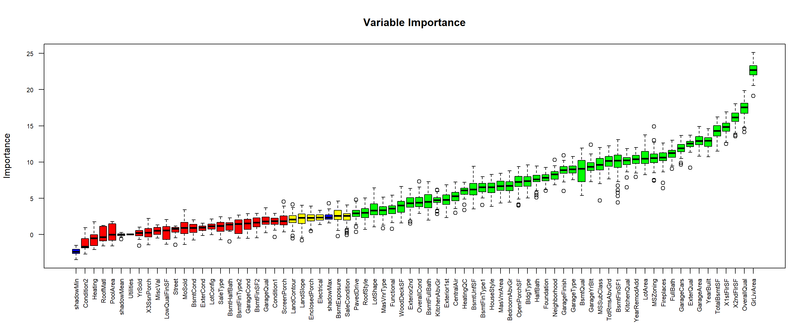

```{r options-chunk, include=FALSE}
knitr::opts_chunk$set(echo = TRUE, 
                      eval = TRUE, 
                      message = FALSE,
                      warning = FALSE, 
                      include = TRUE,
                      fig.path = "figures/")
```

```{r pacotes-selecionados, message=FALSE, warning=FALSE, include=F}

  suppressMessages(library(MASS))
  suppressMessages(library(tidyverse))
  suppressMessages(library(data.table))
  suppressMessages(library(ggplot2))
  suppressMessages(library(lattice))
  suppressMessages(library(latticeExtra))
  suppressMessages(library(Boruta))
  suppressMessages(library(ggpubr)) 
  suppressMessages(library(gridExtra))
```


# Objetivos

  * Quais Modelos utilizar ? 
  * Modelos no Radar
      * Regressão por Redes Bayesians
      * Modelos Lineares Generalizados
      * Modelos de Machine Learning
      
  * Métricas de Performance
  * * RMSE
  

# Conjunto de dados


```{r read-modeltrain, message=FALSE, warning=FALSE}
model.train <- fread('../outputs/model.train.csv', 
                     sep=",", 
                     showProgress = FALSE)[,-1] %>%
                     data.frame(stringsAsFactors = T) %>% 
                     select(Id,SalePrice,everything())  
```


```{r convert-string-to-categorical}
tipo <- lapply(model.train,class)
model.train[,unlist(tipo) != 'integer'] <- data.frame(apply(model.train[,unlist(tipo)!='integer'],2,factor))
model.train
```


## Importancia das variáveis  

Obs: Esta parte do código ficará comentada para o markdown rodar mais rápido e para ilustrar o resultado irei apenas colocar a imagem da sugestão de seleção de variáveis feita pelo boruta, caso queiram rodar o código é só descomenta-lo.


<!-- ```{r fig.width=15, fig.height=6} -->
<!-- set.seed(2510) -->
<!-- boruta_output <- Boruta(SalePrice ~ ., data=model.train[,-1], doTrace=2)  # perform Boruta search -->
<!-- ``` -->


<!-- ```{r} -->
<!-- boruta_signif <- names(boruta_output$finalDecision[boruta_output$finalDecision %in% c("Confirmed", "Tentative")])  # collect -->
<!-- print(boruta_signif) -->
<!-- ``` -->

<!-- ## Plot da importância da variável -->

<!-- ```{r fig.width=15, fig.height=6} -->
<!-- plot(boruta_output, cex.axis=.7, las=2, xlab="", main="Variable Importance") -->
<!-- ``` -->




# Ajustando um modelo aos dados

Como a distribuição da variável SalePrice é assimétrica com cauda a direita, podemos utilizar um MLG, modelos linerares generalizados, em particular a distribuição Gamma. 

Em um primeiro momento utilizei as variáveis selecionadas pelo Boruta, 50 variáveis, porém após essa pré-seleção observei que algumas delas estavam com os p-valores muito alto então apliquei o método StepAic para continuar o processo de seleção o que me levou a configuração final abaixo.

Ainda é importante lembrar que dentro do contexto de negócio o processo de seleção de variáveis conta com o apoio dos especialistas da área, o que ajuda bastante, porém as vezes por questões intrínsecas do negócio uma variável que é rejeitada por algum método de seleção acaba permanecendo no modelo. 


```{r ajutando-com-a-distribuição-gamma-mgl}
fit.model = glm(SalePrice ~ MSSubClass + LotArea + OverallQual + 
    OverallCond + YearBuilt + YearRemodAdd + MasVnrArea + BsmtUnfSF + 
    TotalBsmtSF + X2ndFlrSF + GrLivArea + BsmtFullBath + BedroomAbvGr + 
    KitchenAbvGr + TotRmsAbvGrd + Fireplaces + GarageYrBlt + 
    GarageCars + GarageArea + WoodDeckSF + MSZoning + Neighborhood +  
    HouseStyle + Exterior1st + MasVnrType + ExterQual + BldgType + 
    Foundation + BsmtQual + BsmtExposure + BsmtFinType1 + HeatingQC + 
    CentralAir + KitchenQual + Functional + SaleCondition,
    data = model.train,family=Gamma(link=identity))

summary(fit.model)
```

## Teste Qui-Quadrado

```{r test-qui-quadrado}
round(1-pchisq(13.611,1192, ncp = 0, lower.tail = TRUE, log.p = FALSE),3)
```

O desvio do modelo foi de D($y$;$\hat{\mu}$) = 13.611, com 1192 graus de liberdade, que leva a P = 1,00 e indica um ajuste adequado.


# Dados de teste


```{r read-modeltest, message=FALSE, warning=FALSE}
model.test <- fread('../outputs/model.test.csv', 
                     sep=",", 
                     showProgress = FALSE)[,-1] %>%
                     data.frame(stringsAsFactors = T) %>% 
                     select(Id,everything())  
```


```{r convert-string-to-categorical-test}
tipo <- lapply(model.test,class)
model.test[,unlist(tipo) != 'integer'] <- data.frame(apply(model.test[,unlist(tipo)!='integer'],2,factor))
model.test
```

## Predição 

```{r predict}
predicao <- predict(fit.model,model.test)
```

## Plot Ecdf

Como não temos os valores da variável SalePrice no conjunto de dados de teste, podemos apenas verificar se a distribuição dos dados preditos esta de acordo com a distribuição dos dados reais da variável SalePrice do conjunto de dados de treino. A da distribuição impírica acumulada dos dados pode nos ajudar com isso. 

```{r plot-ecdf, fig.width=15,fig.height=6}
latticeExtra::ecdfplot(~ fit.model$data$SalePrice + predicao, 
                         auto.key=list(space='bottom',col = c('red','blue')), 
                         col = c('red','blue'), 
                         lwd = c(2,3), 
                         xlab =" ",ylab = 'F(x)',
                         main = 'Distribuição Empírica Acumulada')
```

Observe que há concordância entre os valores preditos e reais da variável SalePrice. Uma outra forma de verificar essa condordância é plotar as distribuições de densidade e frequência, como fiz abaixo. 


```{r data-frame-predict}
predicao <- data.frame(predicao)
```


```{r densidades, fig.width=15, fig.height=6}
p1 <- ggpubr::ggdensity(predicao, x = "predicao", 
              fill = "#0073C2FF", color = "black",
              add = "mean", rug = TRUE) +
              xlim(xlim = c(0,max(model.train$SalePrice)) ) +
              ylim(ylim = c(0,8.0*10^(-6))) +    
              labs(title = 'Distribuição da densidade das predições') +
              theme_dark()

p2 <- ggpubr::ggdensity(model.train, x = "SalePrice", 
              fill = "lightyellow", color = "black",
              add = "mean", rug = TRUE) +
              xlim(xlim = c(0,max(model.train$SalePrice)) ) +
              ylim(ylim = c(0,8.0*10^(-6) )) +  
              labs(title = 'Distribuição da densidade da variável SalePrice') +
              theme_dark()

gridExtra::grid.arrange(p1,p2,nrow = 1)
```


Embora as distribuições estejam muito parecidas, os gráficos acima nos permite visualizar que os valores preditos assume uma variabilidade um pouco maior a partir do valor médio da distribuição. 


```{r histogramas, fig.height=6, fig.width=15, message=FALSE, warning=FALSE}
p3 <- ggplot(predicao, aes(x = predicao)) + 
      geom_histogram(bins = 100, 
                     color = "black", 
                     fill = "#0073C2FF") +
      xlim(xlim = c(0,max(model.train$SalePrice)) ) +
      ylim(ylim = c(0,100)) +
      labs(title = 'Distribuição de frequência das predições') +
      theme_dark()

p4 <- ggplot(model.train, aes(x = SalePrice)) + 
      geom_histogram(bins = 100, 
                     color = "black", 
                     fill = "lightyellow") +
      xlim(xlim = c(0,max(model.train$SalePrice)) ) +
      ylim(ylim = c(0,100)) +
      labs(title = 'Distribuição de frequência da variável SalePrice') +
      theme_dark() 


gridExtra::grid.arrange(p3,p4,nrow = 1)
```

Se no conjunto de teste a variável SalePrice mantiver a mesma distribuição do conjunto de treino meu modelo terá boas chances de performar bem.      


```{r fig.width=15,fig.height=6}
plot(fit.model$data$SalePrice,
     fit.model$fitted.values,
     col = c('blue','red'), 
     pch = 20,
     type = 'p',
     xlab = 'SalePrice',
     ylab = 'Valores Ajustados',
     main = 'SalesPrice vs Valores Preditos')
abline(0,1)
legend('topleft',legend = c('SalePrice','Valores ajustados'),col = c('blue','red'), lty = c(2,2) )
```

Este plot mostra que nosso modelo é eficaz para valores até $4e+05$, isso ocorre por existirem poucas casas com valores muito alto no conjunto de dados, pois a variabilidade tem convergência assintótica, ou seja, $\sigma_{_{n \implies \infty}} \implies 0$. Uma alternativa visando melhorar a performance do modelo para valores acima de $4e+05$ é criar variáveis que ajudam a discriminar a variável resposta neste segmento. Através de uma clusterização acho que isso seria possível.  


## Resíduos

```{r fig.width=15,fig.height=4}
plot(fit.model$residuals, pch = 20, type = 'p', main = 'Resíduos')
```

Os resíduos estão bem distribuídos em torno de zero e isso é muito bom! 
Considerando que o ajuste está bom, é interessante notar que os resíduos que estão muito acima de zero podem ser casos em que o valor do imóvel esta fora do praticado pelo mercado e isto implica que dificilmente um imóvel nesta situação seria facilmente vendido fazendo com que a equipe de vendas perdesse tempo e energia. Já os imóveis com preços abaixo de zero seriam facilmente vendidos porém o lucro da venda seria baixo.    


# Rsquare

```{r r-square}
rss <- sum((fit.model$residuals)^2)  ## soma dos quadrados dos resíduos 
tss <- sum((fit.model$data$SalePrice - mean(fit.model$data$SalePrice))^2)  ## soma total dos quadrados
(r.square <- 1-rss/tss)
```

Este é um bom resultado para uma primeira iteração, o modelo consegue explicar cerca de 89% da variabilidade dos dados.


# RMSE

```{r rmse}
sqrt(mean((fit.model$residuals)^2))
```

Com esse RMSE somente o kaggle me dirá se está bom ou não.


# Gráficos de Dispersão


```{r dispersao, fig.width=15,fig.height=6}
layout(matrix(c(1,1,2,2,3,3), ncol = 2, nrow = 3, byrow = T))
plot(fit.model$data$SalePrice,
     col = 'black', 
     pch = 20,
     type = 'p',
     ylim = c(0,7*10^5),
     xlab = 'SalePrice',
     ylab = '',
     main = 'Valores reais de SalesPrice')
plot(fit.model$fitted.values,
     col = 'blue', 
     pch = 20,
     type = 'p',
     ylim = c(0,7*10^5),     
     xlab = 'SalePrice',
     ylab = '',
     main = 'Valores Ajustados de SalesPrice')
plot(predicao$predicao,
     col = 'red', 
     pch = 20,
     type = 'p',
     ylim = c(0,7*10^5),     
     xlab = 'SalePrice',
     ylab = '',
     main = 'Valores Preditos com df.test para SalesPrice')
```

# QQ-Plot

O QQ-plot pode nos ajudar a ter uma idéia de como será o resultados da predição, aparemtemente será bom. 

```{r qqplot, fig.width=15,fig.height=5}
qqplot(sort(fit.model$data$SalePrice)[1:1318],
       sort(predicao$predicao),
       main = 'QQ-plot',
       ylab = 'Predição',
       xlab = 'SalePrice',
       col = c('blue','red') )
abline(0,1)
```

# Exportando para submissão no Kaggle

```{r export-to-submission}
submit.glm <- data.frame(Id = model.test$Id,SalePrice = predicao$predicao, stringsAsFactors = F)
write.csv(submit.glm, file="../outputs/saleprice_glm.csv",row.names = FALSE,quote=FALSE)
```


# Conclusão

Neste primeiro momento os resultados são razoáveis.


